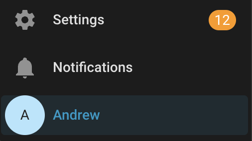
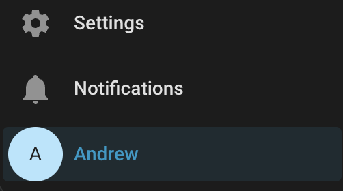

# Hide Settings Badge

[](https://github.com/hacs/integration)

Hides the **update / notification badge** on the **Settings** item in the Home
Assistant sidebar - the little number that appears when updates are available.

Updates are **not** dismissed or hidden anywhere else: they still show normally
when you open **Settings**. This only removes the badge from the sidebar.

Are you triggered by notification badges that you can't dismiss? Do you have
plugins that get updates on an hourly basis? Do you prefer to update your HA
installation on your own schedule without having a dot on your page all the time?
This small frontend module is for you.

## Before / After

| Before | After |
| ------ | ----- |
|  |  |

## Install

### Via HACS (custom repository)

1. In HACS, open the **⋮** menu (top right) → **Custom repositories**.
2. Repository: `https://github.com/ajerman/hide-settings-badge`
   Category/Type: **Dashboard**.
3. Click **Add**, then find **Hide Settings Badge** in HACS and **Download** it.
4. Add the module to your `configuration.yaml` (see below), restart Home
   Assistant, and hard-refresh your browser (Ctrl/Cmd + Shift + R).

> **Important:** this is a *frontend module*, not a Lovelace dashboard resource.
> Do **not** add it under Settings → Dashboards → Resources. Add it under
> `frontend:` as shown below.

### Manual

1. Copy `hide-settings-badge.js` to `<config>/www/hide-settings-badge.js`.
   (The `www` folder is served at `/local/`.)
2. Continue with the configuration step below.

## Configuration

Add the module to `configuration.yaml`:

```yaml
frontend:
  extra_module_url:
    # HACS install:
    - /hacsfiles/hide-settings-badge/hide-settings-badge.js
    # OR manual install:
    # - /local/hide-settings-badge.js
```

Restart Home Assistant, then hard-refresh the browser.

## How it works

The Settings sidebar item renders (in current Home Assistant) as:

```html
<ha-md-list-item class="configuration" id="sidebar-config" href="/config">
  ...
  <span class="badge">12</span>
</ha-md-list-item>
```

The module injects a small stylesheet into the `ha-sidebar` shadow root:

```css
ha-md-list-item.configuration .badge,
ha-md-list-item#sidebar-config .badge { display: none !important; }
```

It re-applies on navigation and tab focus so it survives sidebar
collapse/expand. It is independent of your active theme, switching themes will
not break it.

## Compatibility

Works on **Home Assistant 2025.5+** (when the sidebar moved to the
`ha-md-list-item` markup this targets); verified on **2026.5.x**. Because it
targets frontend markup, a future Home Assistant release that renames the
sidebar element could require a one-line selector update. Issues/PRs welcome.

## License

[MIT](LICENSE)
